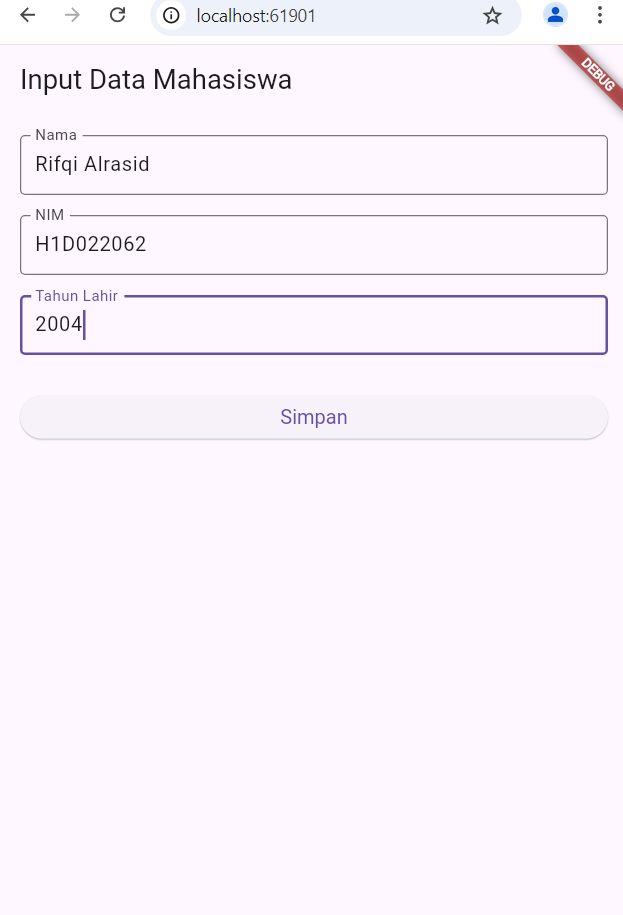
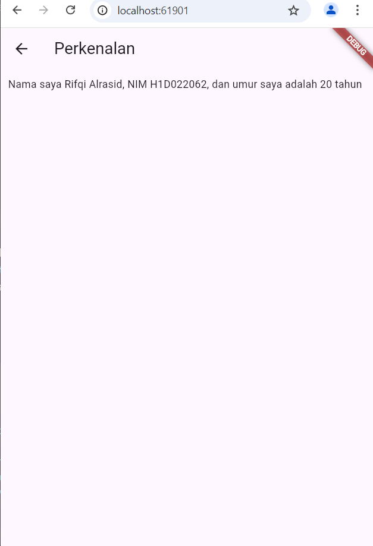

# Tugas Pertemuan 2

Nama : Rifqi Alrasid

NIM : H1D022062

Shift Baru: C

## Screenshot


Pada halaman form, data yang diinput oleh pengguna disimpan di dalam masing-masing `TextEditingController` untuk setiap field (nama, nim, tahun). Ketika tombol "Simpan" ditekan, data dari controller tersebut akan diambil dan disimpan ke dalam variabel lokal (nama, nim, dan tahun). Setelah itu, menggunakan `Navigator`, halaman akan berpindah ke halaman `TampilData` dengan membawa data tersebut sebagai parameter dalam konstruktor `TampilData`.



Di halaman `TampilData`, data yang diterima melalui konstruktor (`nama`, `nim`, dan `tahun`) digunakan untuk menghitung umur dan ditampilkan sebagai teks dalam widget `Text`. Data ini tetap statis karena ditransfer melalui konstruktor dan diakses secara langsung di dalam widget Stateless.

(Mengirim data)
```
Navigator.of(context).push(
  MaterialPageRoute(
    builder: (context) => TampilData(nama: nama, nim: nim, tahun: tahun),
  ),
);
```

(Menerima dan menampilkan data)
```
const TampilData({
  required this.nama,
  required this.nim,
  required this.tahun,
});

final String nama;
final String nim;
final int tahun;
```

Proses ini menggunakan konstruktor untuk passing data antar halaman, dan data ditampilkan langsung di halaman tujuan.